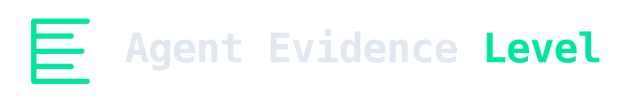

<h1 align="center">
  
</h1>

<p align="center">
  <strong>Open standard for grading AI-agent evidence.</strong>
</p>

<p align="center">
  <a href="https://github.com/luckyPipewrench/agent-evidence-levels/actions/workflows/check.yml"></a>
  <a href="https://go.dev/dl/"></a>
  <a href="LICENSE-SPEC"></a>
  <a href="LICENSE"></a>
  <a href="#status"></a>
  <a href="https://discord.gg/badNfhGKTc"></a>
</p>

<p align="center">
  A vendor-neutral standard maintained by <a href="https://pipelab.org">PipeLab</a>.
  Producers and operators cannot award AEL grades, including PipeLab and Pipelock.
</p>

A measurement standard for AI-agent audit evidence. AEL grades a record of AI-agent activity, from
AEL-0 to AEL-4, by what an independent party can verify, and what omission they can detect, without
trusting the vendor or the operator.

- **`SPEC.md`** — the standard (CC BY 4.0).
- **`docs/ARTIFACT-FORMAT.md`** — the artifact format the checker consumes.
- **`docs/CHECKER-DESIGN.md`** — the check matrix and fixture matrix.
- **`checker/`** — the reference checker `aelcheck` and fixture generator `aelgen` (Apache-2.0).
- **`fixtures/`** — the conformance corpus: valid per-rung artifacts, perturbed artifacts the checker
  must reject or flag, and valid limitation cases it must accept without overstating (Apache-2.0).
- **`GRADES.md`** — the evidence registry; the editor's declaration is first and held to the same rule.
- **`docs/VERSIONING.md`** — draft stability, compatibility, and donation posture.
- **`docs/RATIONALE.md`** — non-normative positioning and adoption guidance, kept out of the spec.
- **`docs/PRIOR-ART.md`** — how AEL relates to existing standards (transparency logs, audit-log and retention standards, evidence-handling), and what it deliberately does not restate.
- **`docs/EXAMPLE.md`** — a worked end-to-end example: a self-run result, signed evaluation package, replay, and byteflip failure.
- **`docs/VERIFICATION-PACKAGE.md`** — signed packages for replaying an evaluation and publishing a
  verified per-run result.
- **`schema/`** — JSON Schemas for the record payload and manifest, for independent reimplementers.
- **`CONTRIBUTING.md`** — contribution rules and required validation.

## Why a checker ships with the spec

The standard's bar is "earned, not asserted": a public grade counts only when a verifier that is
neither the producer nor the operator checks a real artifact with a checker that passes the published
conformance corpus, then publishes the signed verification package required by `SPEC.md` section 5.2.
Live health and artifact capability may be self-reported, but neither carries an AEL number. A standard
with that bar that shipped without a runnable checker would be the same attestation it criticizes. So
the checker and the fixture corpus are part of v0.1, not a follow-up.

## Run it

```
make build     # build aelcheck, aelgen, and aelpackage
make gen       # regenerate the fixture corpus from a fixed test seed
make test      # go test ./...
make check     # regenerate + grade the whole corpus; assert every case matches its expect.json
```

Release archives contain all three commands. Check the build identity with `aelcheck --version`, `aelgen --version`, or `aelpackage --version`; source builds report `devel`.

To install the commands from a checkout, run `go install ./checker/cmd/...`. Go writes them to `GOBIN`, or to the `bin` directory under the first `GOPATH` entry when `GOBIN` is unset; add that directory to `PATH` before invoking `aelcheck`, `aelgen`, or `aelpackage`.

`make check` printing, for each rung, the valid fixture graded at that rung and every fixture
perturbation rejected or flagged, demonstrates that the checker passes the conformance corpus. A
real run still needs the signed verification package defined in `SPEC.md` section 5.2.

```
aelcheck --keys <keysdir> <artifact>
```

grades one artifact and prints the full grade line plus a per-check `PASS` / `FAIL` / `UV`
table. `UV` means unable to verify. Use `--min-grade N` to require every final run to earn at
least AEL-N, where N is 0 through 4.

Exit status 0 means every run is final and earned the required grade. Status 3 means at least one
final run did not earn it, while status 4 means at least one run remains open and is not final.
Status 4 takes precedence when an artifact has both conditions, so automation retains the
not-final signal; every nonzero status remains a failed requirement. Statuses 1 and 2 mean the
checker could not complete and the command was used incorrectly, respectively.

```
aelpackage --keys <trust-root> validate <package-dir>
```

validates a signed evaluation package or verification record. A verification record needs a separately signed current-status statement and a relying-party evaluation time before a consumer may display `VERIFIED`; see `docs/VERIFICATION-PACKAGE.md`.

## Licensing

The specification (`SPEC.md`) is CC BY 4.0. The checker and fixtures are Apache-2.0. See
`LICENSING.md`.

CC BY 4.0 lets anyone copy or adapt the written specification with attribution. Apache 2.0 lets
anyone use, modify, and distribute the checker and corpus under its notice and patent terms.

GitHub may label the repository license as "Other" because this split is intentional and can't be represented by one repository-wide license badge.

## Status

v0.1 draft. This repository is vendor-neutral by construction: `SPEC.md` carries no product marks;
concrete deployments (including the editor's) are graded in `GRADES.md`. The intended governance
end state is donation to a neutral body after the draft has real independent use and critique.

See `docs/VERSIONING.md` for the draft stability, compatibility, and donation policy.
